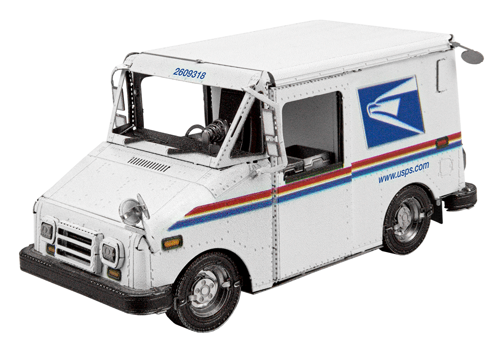

# Capstone Project

ESP32 Mail Alert System

# By Carson Alberding -- Computer Science Pathway

# Introduction

Hardware development based

Initially planned for research project

Breadboarding / circuit design

Worked with UD Computer Engineering professor Dr\. Richard Martin

Shifted project focus

# Problem & Initial Goals

Build some kind of device that detects when the mail comes

Audible/digital notification system

Attempted very briefly in the past with Raspberry Pi

Decided to take a different approach with the ESP32

Build a reliable and sustainable solution

Solar powered

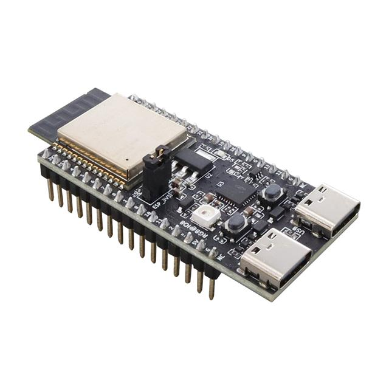

# ESP32

Low\-cost & low power WiFi\-enabled microcontrollers

Programmable through Arduino IDE \(C\+\+\)

Sensor control through GPIO pins

Can be easily powered by batteries or USB

Good fit for the project

# Materials

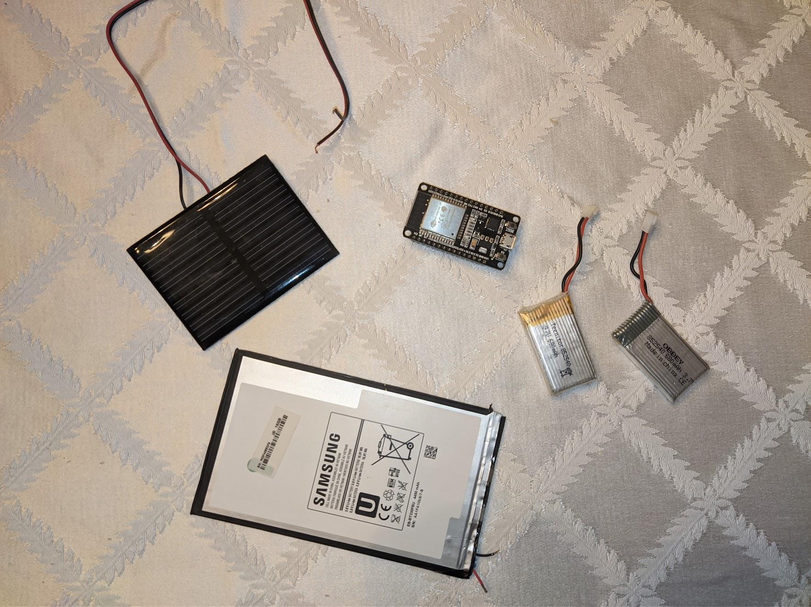

ESP32 dev board

Soldering stuff

Photoresistor

Wire

Battery

Multimeter

Solar Panel

Charging regulator

Voltage regulator

Raspberry Pi

Bluetooth Speaker

# Problem 1: WiFi

Needed to test whether the WiFi strength in the mailbox was sufficient

Using Arduino IDE\, coded simple wifi strength program  _\(Magdy\, n\.d\.\)_

Connected the ESP32 to laptop through USB to display results

Very poor wifi connection

Able to maintain connection \(possibly?\) but not establish a new one

Workable signal \-30dBm to \-85dBm

Results were in the \-90dBm range

Moving the router didn’t help

Making an antenna didn’t help

A lot of trial and error overall

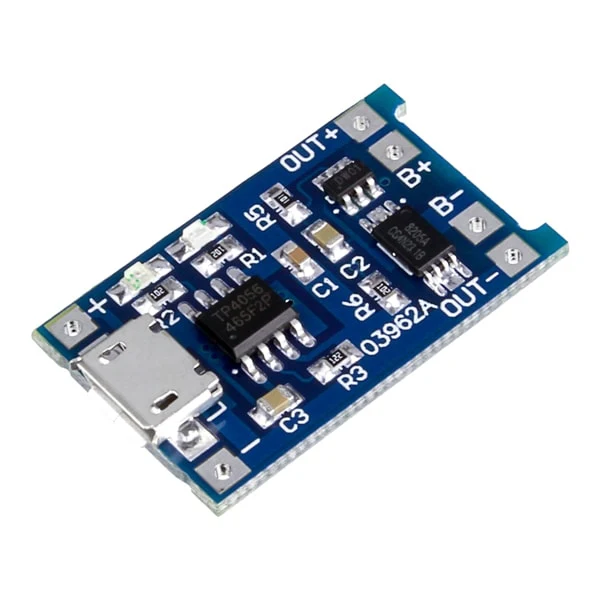

# Problem 2: Power

Initially planned to use 700mAh 3\.7v drone battery

Planned to use solar power to charge the battery

Bought TP4056 charging regulator  _\(Power ESP32\, n\.d\.\)_

Bought MCP1700 voltage regulator

Planned to use a feature called deep sleep on ESP32  _\(“Sleep\,” n\.d\.\)_

Active from 12:00 \- 4:30 PM each day\, sleep for the rest

Online sources stated that the ESP32 I had used <<1mA during deep sleep

Actually was about a 10mA draw in deep sleep

Assuming battery is at maximum capacity\, it would likely die in the span of 2 cloudy days

Low quality solar panel did not produce any substantial output with indirect sunlight

# Fixing Issues

Decided that a new ESP32 board was needed to potentially fix these issues

After a bit of research\, I decided to get the much newer ESP32\-c6  _\(“ESP32\-C6\,” n\.d\.\)_

Hoping that it resulted in improved wifi strength and lower sleep power consumption

Didn’t want to bank on the lower power consumption\, so I bought better solar panels

Tried to test if charging was working each day that I could

Putting 2 solar panels in parallel would double the current output

When I got the new ESP32\, I measured <0\.1mA current when sleeping

When it was on\, current was between 30\-40 mA and ~10mA less when wifi was off

WiFi seemed to be better as well inside the house\, with a 10dBm increase in signal

Critical problems seemed to be fixed \-\- for now

# Charging Setup

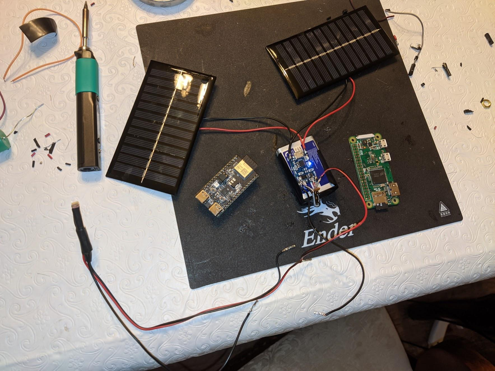

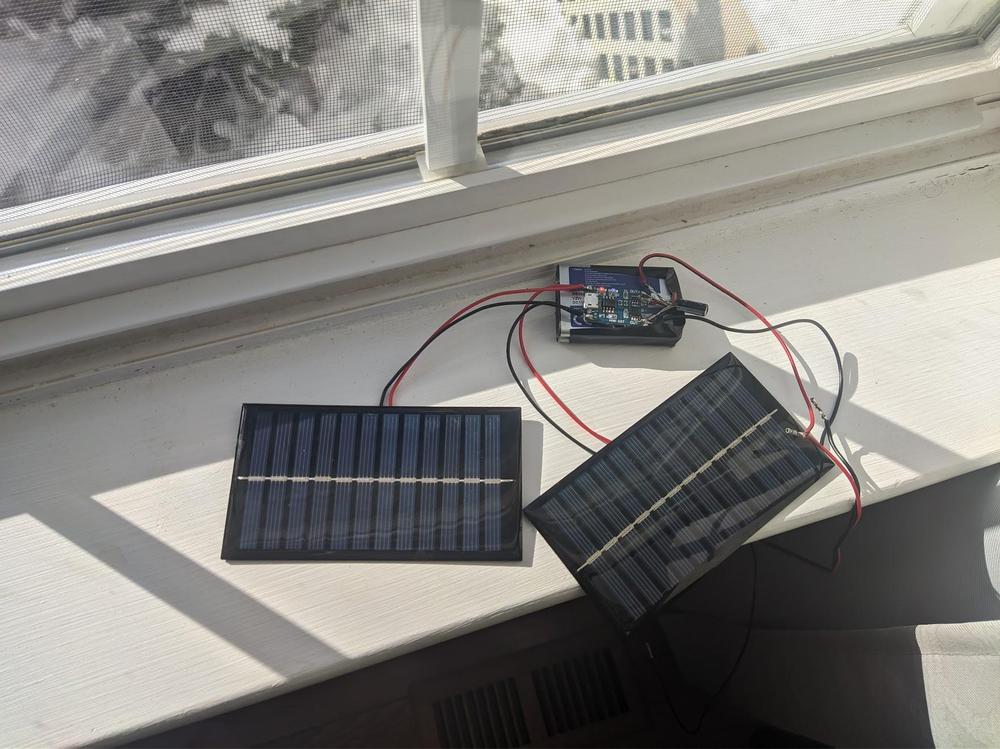

# Coding

With most of the hardware issues figured out\, it was time to start coding the actual software

Planned to use a photoresistor as the sensor\, so one of the GPIO pins on the ESP32 could read it

Needed to design the code around the fact that deep sleep reruns the code from the beginning

Designed to be ran at any time of day or night

Reduce power consumption by limiting its active hours and WiFi usage

# Code Overview: Setup Method

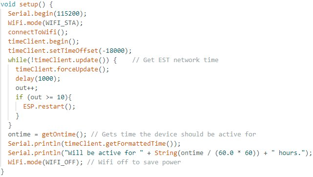

# Code Overview: Loop Method

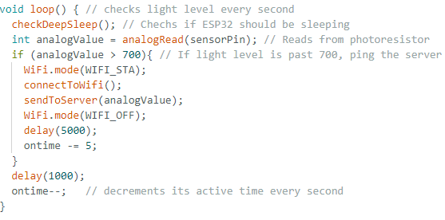

# Code Overview: Time methods

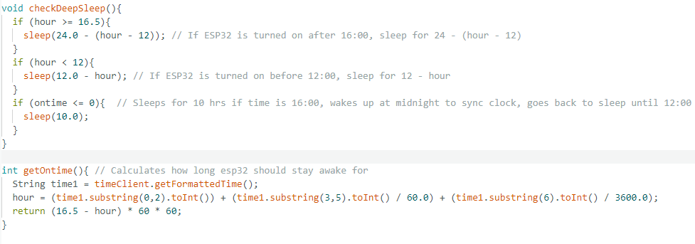

# Mounting the Device

 __Outside the Mailbox__ 

 __Inside the Mailbox__ 

| Pros  No waterproofing Concealed  | Cons  Poor WiFi connection Takes up space Build a hidden setup |
| :-: | :-: |

| Pros   Reliable WiFi Easier wiring setup        | Cons  Waterproofing Hard to access components Finite space Looks ugly |
| :-: | :-: |

# Optimal Solution

Since the mailbox post it sat on was vinyl\, I figured it must be hollow inside

Prying it open revealed a large\, hollow space for all the electronics

No weatherproofing required

Plastic interior resulted in a reliable WiFi connection

Drilled a small hole for wires to pass through

Mounted 2 solar panels with strong double faced tape S & E facing

Routed the photoresistor setup though a small hole in the back corner of the mailbox

Covered all wires and openings with white tape

Ensured that the ESP32 was in an accessible location

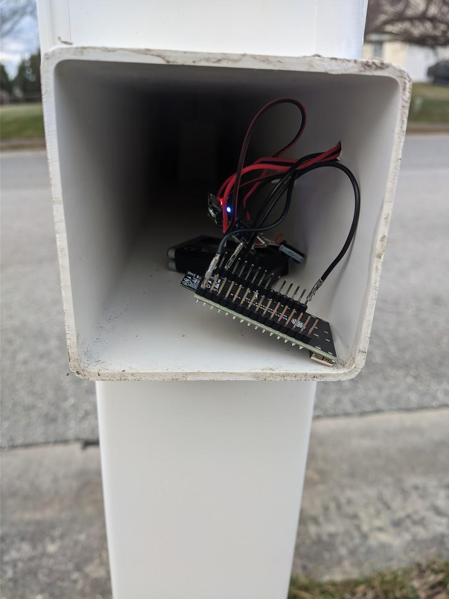

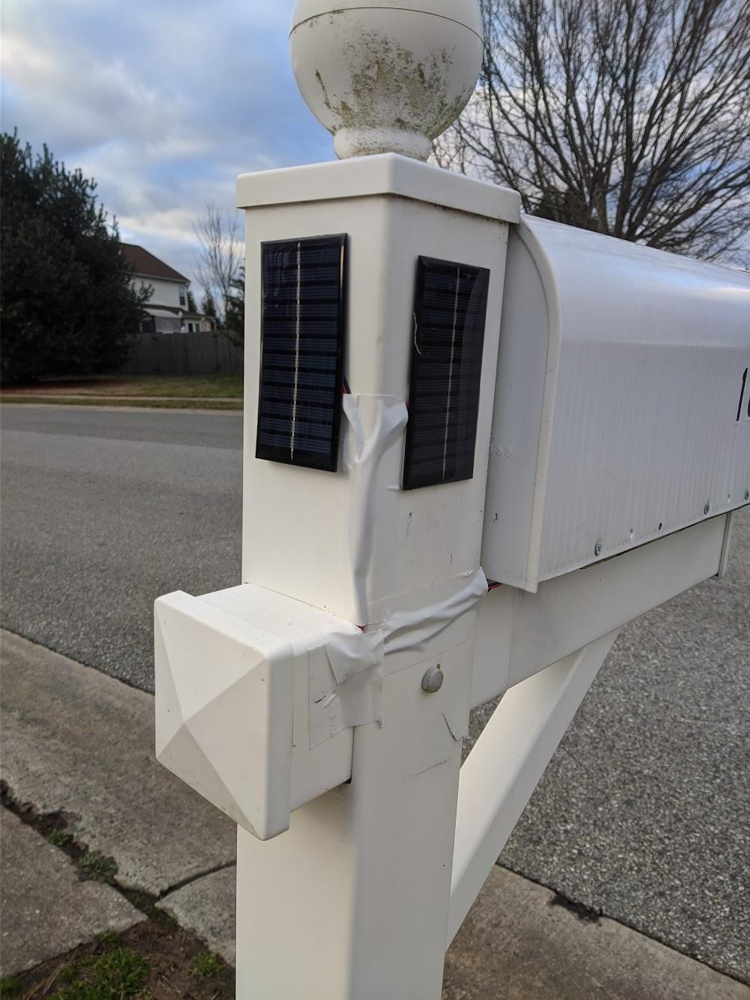

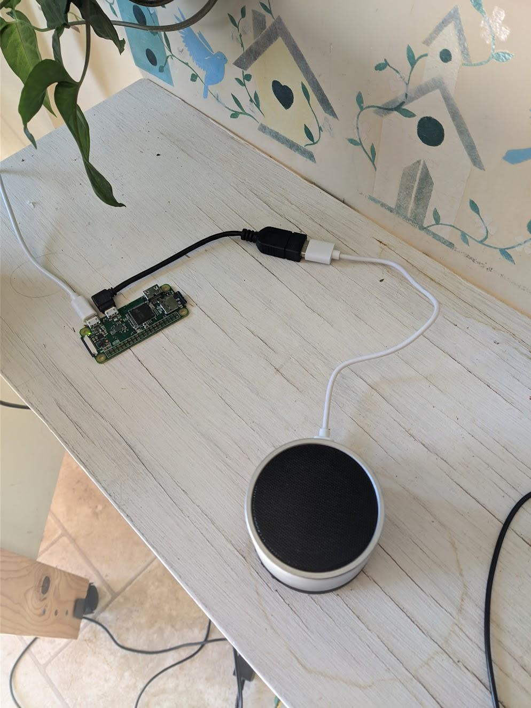

# Server Setup

NodeJs would be easy enough to set up and has a bunch of libraries and support

Decided to go with the Raspberry Pi zero to run the server

Server will be constantly listening for anything sent to it

Was able to connect with a bluetooth speaker to play the sound

Created a linux service to pair with speaker on boot

Used PM2 to automatically start the server on boot  _\(“Running Node”\, 2023\)_

# Server Code

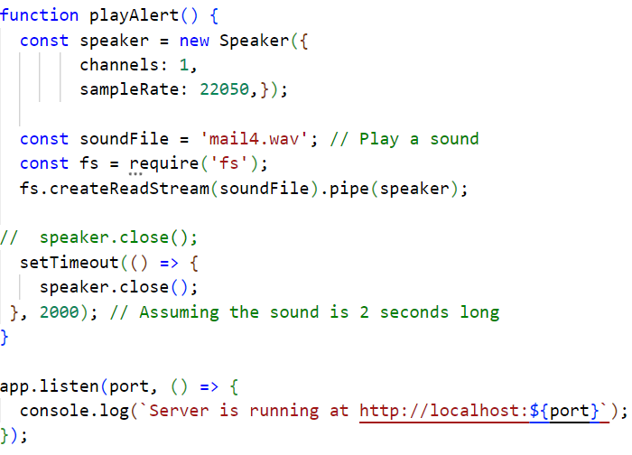

# Initial Results

The device worked\, but only some of the time

I would open the mailbox 4 times to test it\, but the notification would only sound twice

It would stop functioning after a day or two and had to manually reset

It seemed like the device was freezing somehow

The battery and solar setup was working great; no power issues

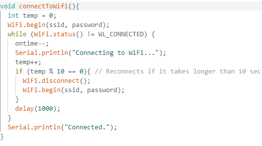

# Debugging

Trying to figure out what was wrong over the next few weeks

Hard to iterate on since I would have to wait long periods of time

It was clear that it would stop functioning after a sleep cycle

Was working fine when I reset it during the day

I changed the variable type for the amount of time it sleeps for

Added a timeout for connecting to wifi and fetching the network time

Changed the format of the audio file it played so it worked every time

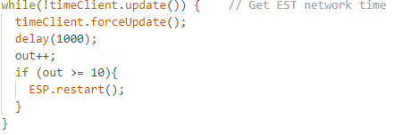

# Reflection

Overall\, the project was a success

Developed a working prototype that functioned as intended

A lot more involved than I originally thought

Many little issues added up

Good learning experience

Glad I was able to make something actually helpful

Appreciate the guidance given by my mentor

# Resources

 _Power ESP32/ESP8266 with Solar Panels and Battery_   \. \(n\.d\.\)\. Random Nerd Tutorials\. Retrieved April 6\, 2024\, from   _[https://randomnerdtutorials\.com/power\-esp32\-esp8266\-solar\-panels\-battery\-level\-monitoring/](https://randomnerdtutorials.com/power-esp32-esp8266-solar-panels-battery-level-monitoring/)_

 _Sleep Modes \- ESP32\-C6 \- — ESP\-IDF Programming Guide v5\.2\.1 documentation_   \. \(n\.d\.\)\. Technical Documents\. Retrieved April 6\, 2024\, from   _[https://docs\.espressif\.com/projects/esp\-idf/en/stable/esp32c6/api\-reference/system/sleep\_modes\.html](https://docs.espressif.com/projects/esp-idf/en/stable/esp32c6/api-reference/system/sleep_modes.html)_

Magdy\, K\. \(n\.d\.\)\. Get ESP32 WiFi Signal Strength \(Arduino\) & RSSI Value\. DeepBlue\. Retrieved April 6\, 2024\, from   _[https://deepbluembedded\.com/esp32\-wifi\-signal\-strength\-arduino\-rssi/](https://deepbluembedded.com/esp32-wifi-signal-strength-arduino-rssi/)_

ESP32 HTTP GET and HTTP POST with Arduino IDE\. \(n\.d\.\)\. Random Nerd Tutorials\. Retrieved April 6\, 2024\, from   _[https://randomnerdtutorials\.com/esp32\-http\-get\-post\-arduino/](https://randomnerdtutorials.com/esp32-http-get-post-arduino/)_

Running Node\.js Apps with PM2 \(Complete Guide\)\. \(2023\, October 25\)\. Better Stack\. Retrieved April 9\, 2024\, from   _[https://betterstack\.com/community/guides/scaling\-nodejs/pm2\-guide/](https://betterstack.com/community/guides/scaling-nodejs/pm2-guide/)_

ESP32\-C6 Wi\-Fi 6 & BLE 5 & Thread/Zigbee SoC\. \(n\.d\.\)\. Espressif Systems\. Retrieved April 10\, 2024\, from   _[https://www\.espressif\.com/en/products/socs/esp32\-c6](https://www.espressif.com/en/products/socs/esp32-c6)_

